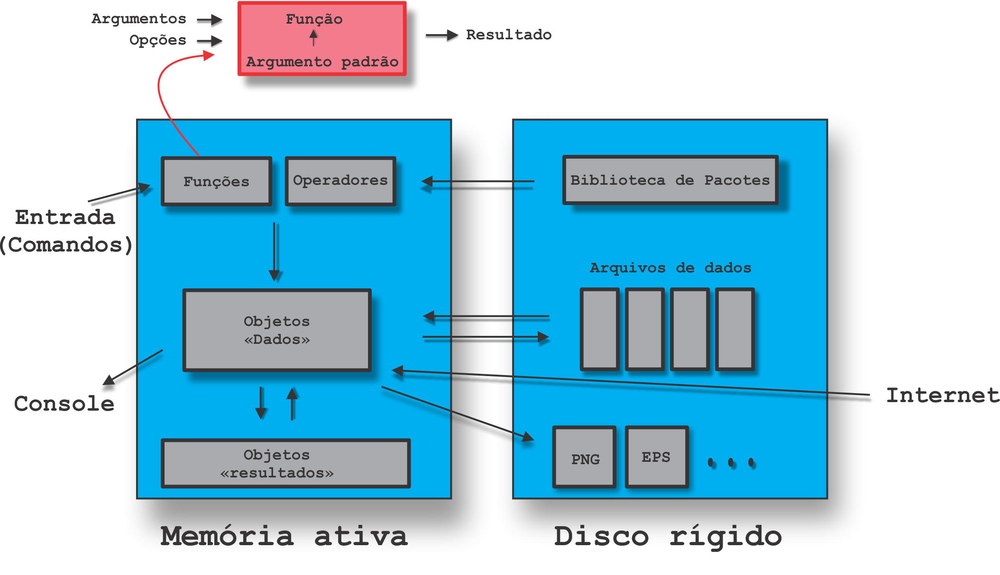

```{r setup, include=FALSE}
knitr::opts_chunk$set(echo = TRUE, fig.cap = " ")
```
--- 

# Objetivo

Descrever as ideias básicas sobre o ambiente R:

- Como instalar o R e RStudio;
- Diferenças entre o R e a IDE RStudio;
- Como o R trabalha;
- Comandos elementares;
- Objetos;
- Manipulação com objetos;
- Importação de dados;
- Pacotes:
  - Instalação;
  - Como usar.

# Apresentação do relatório

Diante do objetivo do relatório, apresentaremos nas próximas subseções, os pontos a serem discutidos.

## Como instalar o R e o RStudio

  Primeiramente, deverá ser instalada a linguagem no OS, visto que qualquer programa que utiliza a não funcionará sem ela no sistema operacional.

O link para o download (para sistemara operacionais Windows) pode ser encontrado **[neste endereço](https://cran.r-project.org/bin/windows/base/)**. 

  O RStudio se encontra em um outro site, visto que é um projeto 
alheio ao desenvolvimento da linguagem.

  **[Esta seção o redirecionará atéo endereço que o forncerá o download do RStudio](https://www.rstudio.com/products/rstudio/download/#download)**

## Diferenças entre o R e a IDE RStudio

  O primeiro programa instalado, o R em si, consiste-se apenas no terminal e compilador do código escrito. Apesar de ser possível de trabalhar apenas com ele, é um processo que pode ser mais tedioso e imprático.

A Imagem 1 mostra o terminal básico do R:
  
  {width="50%"}

  \n O RStudio é um IDE: um ambiente de desenvolvimento interno integrado, que se consiste em "um software para criar aplicações que combina ferramentas comuns de desenvolvimento em uma única interface gráfica do usuário (GUI)"^[Fonte: [Redhat](https://www.redhat.com/pt-br/topics/middleware/what-is-ide)], facilitando o uso da linguagem, assim como adicionando algumas ferramentes a mais para desenvolvimento de códigos nesta linguagem.
  
A Imagem 2 mostra o a interface RStudio:
  
{width="50%"}

## Como o R trabalha

O funcionamento dos códigos em R é ancorado em três princípios básicos:

-   **Tudo que existe no R é um objeto**

-   **Tudo o que acontece no  R é uma chamada de função**

-   **Interfaces de outros programas são parte do R**

{width="50%"}

A Imagem 3 exemplifica o esquema geral de funcionamento da linguagem,

A colocar por extenso, qualquer ação ocorrendo no código é considerado uma função, as quais serão armazenadas como objetos na memória (mais especificamente, os objetos indicam onde na memória tais informações serão armazanedas).

As funções internamente são estruturadas por argumentos que realizam a modificação dos objetos de entrada, com o poder ainda do próprio argumento se modificar durante sua execução. As respostas de saída também são objetos, os quais podem ser usados como argumentos em outras funções.

## Comandos elementares

Os comandos elementares são funções naturais a linguagem e que podem ser executados sem necessidade de implementações de bibliotecas extras (sinais de operação matemática, operadores boleanos, expressões de atribuição de valor como o sinal de igualdade ou seta, etc.). Elas podem ser divididas em dois grupos diferentes: comandos de expressões e comandos de atribuição. A exemplo, observe a operação de multiplicação simples abaixo:

```{r}

6*3

```

Internamente, o sinal de multiplicação `*` é uma função interna imbutida a linguagem. O compliador, por sua vez, observa os três objetos escritos na linha: `6`, `*` e `3` e faz a chamada da função interna e realiza seus argumentos. A resposta é processada e imprimida no terminal como um novo objeto.

A seguir, segue uma tabela com operadores e funções básicas do R:

| Função | Natureza | Finalidade |
|:------:|:--------:|:-----------|
| + | Aritmética | Adição |
| - | Aritmética | Subtração |
| / | Aritmética | Divisão|
| * | Aritmética |Multiplicação|
| ^ | Aritmética | Exponenciação |
| sqrt() | Aritmética | Raiz quadrada|
| exp()  | Aritmética | Exponencial |
| log() | Aritmética | Logaritmo natural|
| log10 | Aritmética |  Logaritmo na base 10|
| mean()| Estatística | Média|
| var() | Estatística | Variância|
| sd()  | Estatística | Desvio padrão|
| < | Lógico | Menor que|
| > | Lógico | Maior que|
| == | Lógico | Igual a |
| != | Lógico | Diferente de|
| & | Booleano | "AND" |
| `|` | Booleano | "OR"|
| xor() | Booleano | "XOR"|


## Objetos

### Atribuição e criação de objetos

De maneira simplória, objetos são "nomes" que se referenciam a obejtos salvos na memória ativa. Como discutido na aula de objetos no curso "R Básico": "o objeto não tem um nome, mas o nome tem um objeto"^[WICKHAM; Hadley, 2015 _apud_ BATISTA; Ben, 2022. [Link do curso](https://bendeivide.github.io/cursor/nbasico)] 

Os comandos de atribuição, por sua vez, atrelam um "nome" a um objeto, sendo que quando o nome for invocado, o R olhará a qual endereço na memória ativa ele se refere e o conteúdo que está inserto nela, como demonstra no exemplo abaixo: 

```{r}

# o sinal de atribuição será a combinação de caracteres "<-", formando uma seta simples

x <- 5

# imprimindo o conteúdo associado a este objeto

x

# obtendo o endereço de memória a qual "x" se refere

lobstr::obj_addr(x)

```

O compilador, ao ler a linha `x <- 5` liga `x` ao endereço de memória a qual o objeto `5`  está alocado. De agora para frente, enquanto o programa e o computador não foram fechados, toda vez que `x` for invocado, o R estará se referindo àquele endereço de memória para realizar seus argumentos.

### Modo e comprimento

A continuar, todo objeto criado no ambiente R possuirão atributos atrelados a ele. Tais atributos ditam como o objeto deverá se portar ao ser manipulado em funções. Todo objeto possui, no mínimo, dois atributos instrínsecos - modo e comprimento- atrelados a ele a qualquer momento.

O modo representa a natureza do objeto: se ele se trata de um número, número complexo, texto, saída lógica, etc. Observe os exemplos a seguir:

```{r}

# atribuindo "a" a um valor numérico

a <- 25

# obtendo o modo de "a"

mode(a)

#já "b" será associado a um texto e por isso receberá o modo de "character" (caractere)

b <- "ola"

mode(b)

# "c" será uma saída lógica, logo receberá o modo de "logical"

c <- TRUE

mode(c)

```

O comprimento, por sua vez, é o número de elementos que compõe o vetor (ou matriz/conjunto de dados) que o objeto se associa. A demonstração abaixo deixará mais claro:

```{r}

# criando um escalar simples

d <- 1

# obtendo o comprimento do objeto via a função "lenght"

length(d)

# agora, um vetor de caracteres. O comprimento é desassociado a natureza dos objetos

e <- c("joao", "maria", "jose" , "ana")

```

### Tipo de objeto 

O tipo do objeto denota como seus dados devem se estruturar internamente e como ele deve os apresentar quando requistiado. Ele aparecerá nos atributos como a "classe" do objeto. Simplificandos, tipos podem ser separados em duas categorias: vetores atômicos e vetores em lista.

Vetores atômicos só podem receber objetos com o mesmo tipo. Isso significa que, ao tentar colocar dois modos diferentes de objetos juntos, ele automaticamente converterá um deles para ficarem no mesmo modo. Observe o exemplo a seguir sobre demonstração de como designar um vetor a um objeto:

```{r}

# designando v1 como um vetor numerico de comprimento 0

v1 <- numeric(0)

length(v1); mode(v1)

# usando o comando "c" para contatenar vários números ao vetor

v1 <- c(1, 2, 3, 4, 5)

# imprimindo v1

v1

# em vez de "5" ser o último elemento, "abc" será colocado me seu lugar

v1[5] <- "abc"

# imprimindo o novo vetor e identificando seu tipo. Observe que ele se transformou em modo "caractere"

v1; mode(v1) 

# por fim, obtendo a classe do objeto para demonstrar que ele ainda possui apenas um tipo interno

class(v1)

```

Além do escalar (vetor de um elemento só) e o vetor longo simples mostrado, há também a matriz bidimensional, denominada internamente com a classe "matrix":

```{r}

# definindou um vetor de comprimento 9. Os dois pontos entre os números indica para colocar cada número inteiro entre eles

v2 <- c(1:9)

v2

# usando a função dim(...), pode-se definir o tamanho da matriz que nós desejamos

dim(v2) <- c(3, 3)

# imprimindo v2 para demonstrar que ele fora transformado em uma matriz. Sua classe também agora será "matrix"

v2; class(v2)

```

Por fim, nos vetores atômicos, há também as matrizes multidimensionais, classificadas como "arrays" internamente.


```{r}

# definindo um  outro vetor para exemplo, novamente

v3 <- c(1:8)

v3

# usando a função dim() mas agora com três argumentos internos

dim(v3) <- c(2, 2, 2)

# e imprimindo a nova matriz, assim como confirmando sua classe

v3; class(v3)

```

Os vetores em lista são, como o nome indica, são vetores atômicos organizados em uma lista, marcados com índices para sua referência. Há duas classes neste tipo:  lista de dados e quadro de dados.

Lista de dados são vetores cujos elementos em si são outros vetores, como é no caso do objeto `lista` abaixo:

```{r}

# definindo uma lista usando a função "list()"

lista <- list( a = 5:10,
               b = letters[1:26],
               c = v2,
               d = list(a, 1, TRUE))

# observa que os objetos listados podem incluir escalares, vetores, matrizes e até outras listas

lista

# no caso de vetores em lista, há a possibilidade de acessar cada índice usando o cifrão ($) ou [] e a linha que você quer, caso os índices não estejam rotulados

lista$a

```

Finalmente, quadro de dados se comportam de maneira semelhante a planilhas, com a possibilidade de rotular cada coluna, sendo cada linha referida a um índice  numérico.

```{r}

# só para este exemplo, declarando os objetos usados

nome <- character(0); idade <- numeric(0); prof <- character

# definindo um quadro usando "data.frame()"

quadro <- data.frame( nome = c("Ana", "Joao", "Rodrigo", "Alex", "Renata"),
                      idade = c(15, 38, 72, 22, 49),
                      prof = c("Estudante", "Contador", "Aposentado", "Segurança", "Tabelião"))

# imprimindo o quadro de dados

quadro

# assim como a lista, é possível imprimir e manipular uma linha ou coluna, neste caso

quadro[1, ]; quadro$nome

# e também apontar um elemento em específico

quadro[1, 1]

```

## Manipulação de objetos

Até agora, foram demonstrados mais extensivamente funções de atribuição de dados a objetos. Contudo, o conhecimento de manipulação de vetores e matrizes, especialmente, é um dos aspectos mais importantes para desenvolver análise estatística no ambiente R.

Como demonstrado anteriormente, as funções `numeric`, `character` e `logical` podem criar vetores de qualquer comprimento com o tipo respectivo indicado na função.

No caso de escalares, as operações aritméticas e lógicas se comportam como o usual, seguindo a lógica de argumentos e objetos discutidos na seção 2.4: 

```{r}
6 + 3

2 - 7

-10 < 8
```

Para vetores longos, o R fará as operações de elemento a elemente, pareando os que tiverem na mesma posição relativa ao vetor.

```{r}

c(3, 7, 12) + c(1, 4, 6)

c(1, 1.2, 3) * c(0, 10, -5)

c(4, 8 ,5) < c(3, 9, 10)

```

Há o caso especial de, se os vetores tenham comprimentos diferentes em relação ao outro, o R tentará completar os elementos faltantes do menor via sequência lógica, como demonstra o exemplo abaixo:

```{r}

c(2, 4, 6, 8) + c(1, 3, 5, 7, 9, 11)

# veja que o resultado saiu com 6 elementos e, ao fazer uma operação simples, descobrimos que o compilador interpretou os números faltantes como uma repetição do vetor (sendo que os valores completados foram 2 e 4)

```


## Importação de dados

Auxiliado ao RStudio, há múltiplas maneiras de importar dados para o ambiente em que está se operando. A começar usando o RStudio, clique no butão "Import Dataset", na barra de ambiente (quadrante superior direito):

{width="50%"}

Escolha a opção de acordo como o arquivo está salvo (se ele está salvo em bloco de texto, seria From Text", planilha eletrônica no Excel, "From Excel", e por adiante)

Ao confirmar a escolha de arquivo, aparecerá um prompt com as configurações sobre como importar os dados

{width="50%"}

Como estamos importando um arquivo _.csv_ (elementos separados por ponto e vírgula), deveremos escolher o separador como  "semicolon" e o decimal como "comma". Se o arquivo tiver sido configurado corretamente, um novo objeto deverá aparecer no ambiente como quadro de dados.

Outra maneira seria usando funções do próprio R para leitura dos arquivos.

Antes de se iniciar o procedimento, é recomendável colocar o diretório do ambiente no local onde o arquivo se encontra. É bem possível ainda importar dados sem este passo mas o local exato do arquivo deverá ser apontado toda vez para sua leitura. O comando que permite isso é o `setwd()` e como argumento, copie o endereço do local onde o arquivo se encontra.

Por fim, será usado a função `readtable`. Coloque o nome do arquivo em seu argumento. Para garantir a leitura correta do arquivo, há argumentos extras para configurar a configurar, sendo exemplos como `sep` para indicar separadores dos elementes e `dec`  para indicar qual caractere separa casas decimais. Para maior facilidade, também há funções específicas para leitura de formatos específicos de arquivo como `read.csv`. 

## Pacotes

Pacotes são conjuntos de funções que são integrados ao código de uma linguagem, garantindo maior cobertura de operações possíveis, flexibilização do código e outras inúmeras possibilidades. Pacotes são uma parte essencial no uso de qualquer linguagem de programação, inclusive o R.

### Instalação

O RStudio disponibiliza uma interface que já apresenta ligação ao CRAN (*Comprehensive R Archive Network*), repositório oficial da linguagem. Ao abrir o programa, clique na aba "Packages" (localizado no quadrante direito inferior) e clique no botão "Install".

{width="50%"}

Abrirá-se um novo prompt, perguntando qual pacote deverá ser instalado:

{width="50%"}
Caso o pacote esteja disponível no CRAN, basta digitar o nome do pacote e configurar o local onde será instalado. Caso constrário, há como instalar via arquivo comprimido _.zip_, basta mudar a opção de cima e indicar o local em seu computador onde o pacote de se localiza.

Novamente, há a possibilidade de instalar pacotes via funções no prompt de comando, usando a função `install.packages()`. No argumento, coloque o nome do pacote em aspas. Caso esteja disponível no CRAN, o R o procurará automaticamaente para instalação e fará a instalação após a execução do cógido e os argumentos estejam formatos corretamente.

### Como usar

Caso o pacote seja amplamente usado no script, é recomendável o declarar no início do script para que suas funções fiquem carregadas para uso durante sua execução.

Neste caso, deverá ser usado a função `library()` e o nome do pacote dentro do seu argumento, como mostra o exemplo:

```{r}

library(datasets)

cars # função incluída neste pacote

```

Caso seja necessário apenas uma função de um pacote, basta usar a estrutura `pacote::funcaopacote` para apenas o carregar para aquela única função.

```{r}

datasets::cars

```


