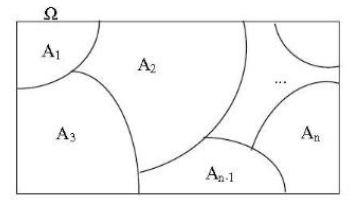
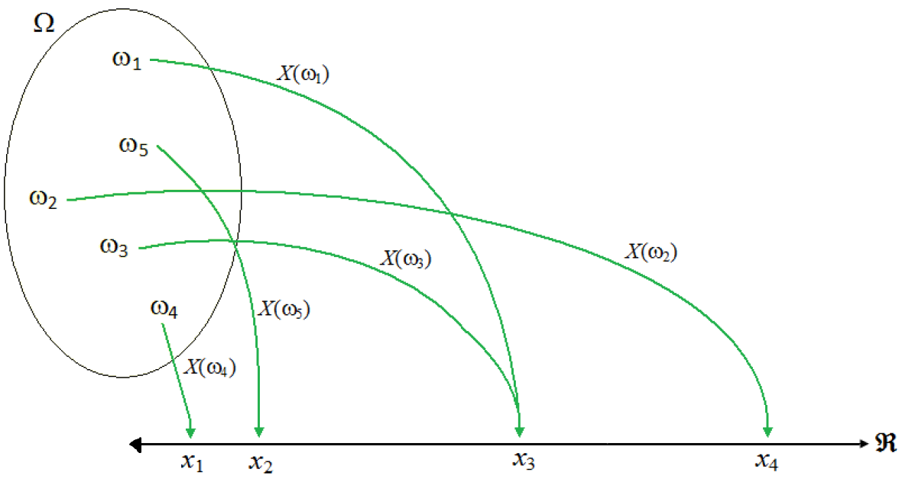
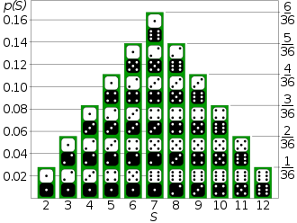
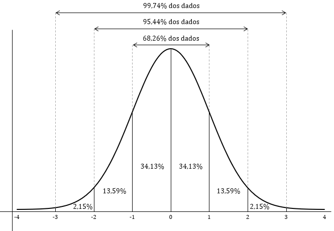

```{r setup, include=FALSE}
knitr::opts_chunk$set(echo = FALSE)
```


## Objetivos  

<div class="black">

Esta apresentação tem como objetivo mostrar os conceitos básicos sobre distribuições de probabilidade, além de demonstrar:

- Diferentes distribuições probabilísticas;
- Uso aplicado de tais distribuições em contexto prático;
- Uso delas no R;

</div>

## Espaço amostral  

<div class="black">

Antes de definir o espaço amostral, deve-se compreender o conceito de evento aleatório, o qual pode ser, simplificademente, atribuído como um evento cujo resultado não pode ser previsto antes de sua execução.

O espaço amostral, por sua vez, representa todos os resultados possíveis de um experimento aleatório. Na estatística, ele é representado pela letra grega ômega maiúsculo "$\Omega$". 

</div>

## Espaço amostral  

<div class="black">

```{r fig1, out.width="80%", fig.align='center', fig.cap="Representação do espaço amostral com os eventos A contidos nele"}

```

[Fonte da imagem](https://biostatistics-uem.github.io/Bio/probabilidade.html)

</div>
## Variável aleatória  

<div class="black">

A variável aleatória, por sua vez, associa os resultados deste espaço amostral a um número/intervalo de números e a uma probabilidade dela ocorrer. A variável aleatória é denotada por $X$ e os seus valores, por $x$.

</div>

## Variável aleatória  

<div class="black">

```{r fig2, out.width="80%", fig.align='center', fig.cap="Associação dos elementos do espaço amostral com os valores da variável aleatória"}

```

[Fonte da imagem](https://pt.wikipedia.org/wiki/Vari%C3%A1vel_aleat%C3%B3ria#/media/Ficheiro:Exemplofuncao.png)

</div>

## Variável aleatória discreta  

<div class="black">

Variáveis aleatórias são divididas de acordo como as probabilidades se relacionam os seus valores. No caso das discretas, cada número será associado a uma probabilidade.

Matematicamente, a sua função que descreve o comportamente desta variável é definida por:

<center>

$F(x) = P(X \leq x) = \sum_{j | x_j < x}^{} p(x_j)$

</center> 

</div>

## Variável aleatória discreta  

<div class="black">

Um exemplo prático seria a probabilidade de tirar um número em um dado justo de seis lados: todos os valores tem a probabiliade atrelada a eles em $\frac{1}{6}$.

Assim, se fizermos a pergunta de qual a probabilidade está associada ao 1, por exemplo, teremos:

<center>

$P(x = 1) = 0.16666...$

</center> 

</div>

## Variável aleatória discreta  

<div class="black">

```{r fig3, out.width="50%", fig.align='center', fig.cap="Exemplo de distribuição de uma variável aleatória discreta na soma das faces de dois dados justos"}

```

[Fonte da imagem](https://pt.wikipedia.org/wiki/Vari%C3%A1vel_aleat%C3%B3ria#/media/Ficheiro:Dice_Distribution_(bar).svg)

</div>

## Variável aleatória contínua  

<div class="black">

Já a contínua, como a própria classificação indica, já tem um domínio contínuo, sendo que os valores da variável em si são **inumeráveis**. Assim, apontar uma probablidade para um valor específico é impossível.

Levando em consideração o Segundo Axioma de Kolmogorov (probabilidade de um evento elementar ocorrer deve ser igual a 1), a funçao de densidade de uma variável aleatória contínua deverá seguir o comportamento de:

<center>

$\int_{-\infty}^{\infty} f(x)dx = 1$

</div>

## Variável aleatória contínua  

<div class="black">

Contudo, é possível determinal a possibililade de um intervalo acontecer. Usando o exemplo interior, suponha que, em vez de dados, seja um gerador de número aleatório que sorteia de 1 a 6, com todos os números tendo uma probabilidade igual de serem lançados.

A probabilidade dele gerar um número entre 0 e 1  será de:

<center>

$P(0 \leq x \leq 1) = \int_{0}^{1}f(x)dx = 0.16666...$


</div>

## Variável aleatória discreta  

<div class="black">

```{r fig4, out.width="70%", fig.align='center', fig.cap="Exemplo de distribuição contínua na forma de uma curva normal"}

```

[Fonte da imagem](https://proeducacional.com/ead/curso-cga-modulo-i/capitulos/capitulo-4/aulas/distribuicao-de-probabilidades-distribuicao-normal/)

</div>

## Modelos de distribuição e o R  

<div class="black">

Como mostrado anteriormente, as variáveis aleatórias podem apresentar um comportamento que pode ser descrito por meio de funções. Algumas destas funções têm amplo uso na ciência e matemática aplicada, visto que elas conseguem representar certos eventos reais ou apresentar uma característica especial para uso em ciências aplicadas.

Tendo em vista isso, o R já vem imbutido com funções para representar certas distribuções, além de ser sempre possível instalar pacotes para obter mais funções para descrever mais modelos.

</div>

## Modelos de distribuição e o R  

<div class="black">

Sendo estas observações feitas, as funções de distribuição do pacote base do R e de alguns outros seguem um padrão comum. Tome como exemplo a função `binom`:

<center> 

`_binom(argumento, size, prob)`

 </center>
 
 A começar pela função chamada, `binom` se refere ao nome da distribuição usada, a binomial (mais detalhes a frente). O prefixo `_` especifica a função a ser usada para o cálculo

</div>

## Modelos de distribuição e o R  

<div class="black">

- `d` se refere a função de densidade de probabilidade do modelo. Ao ser usado, ele retornará a probabilidade atrelada da variável aleatória de valor `argumento` em funções discretas ou a "altura" da função no caso de distribuições contínuas;

- `p` se refere a função de probabilidade de acumulada, ou seja, qual é a possibilidade de obter um valor menor que `argumento` nesta distribuição. Ao usar a estrutura `lower.tail = FALSE`, a função agora irá calcular a probabilidade de obter maior que `argumento`;

</div>

## Modelos de distribuição e o R  

<div class="black">

- `q` será a função de quantil. Ao ser usada, ela calculará qual o intervalo de valores da variável aleatória que tem uma probabilidade menor de ocorrer que o `argumento` inserido. Por este motivo, a função só aceitará `argumento` entre 0 e 1. `lower.tail` também pode ser usado nesta função

- E, por fim nos prefixos, `r` é uma função que gerará um número de `argumentos` de valores que sigam o modelo da distribuição listada. Por causa disso, `argumento` só pode ser representado por números naturais neste caso

</div>


## Modelos de distribuição e o R  

<div class="black">

Dos argumentos internos, além dos dados de entrada e `lower.tail`, `size` e `prob` são argumentos que correspondem a parâmetros numéricos da distribuição: no caso da binomial, `size` representa o número de tentativas do evento e `prob` a probabilidade de um resultado positivo. 


Tais argumentos podem ser referidos com outros nomes em outras funções (`shape`,  `rate`, `mean` e `sd`, por exemplo). Eles podem representar parâmetros específicos a distribuição ($\gamma$ na distribuição gamma, por exemplo) ou simplesmente a média e desvio padrão do modelo. A consulta à função e seus argumentos deverá ser feita antes de ser usada.

</div>

## Exemplos de distribuições probabilísticas  

<div class="black">

Dado o uso destas funções no R, a próxima parte desta apresentação se contentará em demonstrar alguns modelos utilzados nas áreas das ciências gerais:

</div>

## Binomial  

<div class="black">

A distribuição binomial é uma derivação da distribuição de Bernoulli: uma distribuição simples discreta que define a probabilidade de um evento ter sucesso (1) ou não (0).

Contudo, ela leva em consideração que tal evento seja repetido $n$ vezes. Com isso, a binomial atribui uma probabilidade ao número de vezes que se obteve um sucesso. Ela pode ser denotada matematicamente como:

$$P[X = x] = C{_x^n}(1 - p)^{n-x}, x = 0, 1, 2, ... $$

</div>


## Binomial  

<div class="black">

Na fórmula anterior, as incógnitas são:

- $n$, o número de eventos sucessivos realizados; 

- $p$, a probabilidade de um sucesso;

- $C{_x^n}$, o coeficiente binomial, calculado via combinação de $n$ elementos tomados de $x$ a $x$

A distribuição binomial é extremamente útil para descrição de eventos combinatórios na estatística. Ela pode ser observada em eventos simples como lançamento de dados e moedas ou até mais complexos como [testes de eficácia de novos remédios](https://www.statisticshowto.com/probability-and-statistics/binomial-theorem/binomial-distribution-formula/).

</div>

## Binomial  

<div class="black">

A estrutura desta função específica fora demonstrada anteriormente. Para os parâmetros internos, temos:

- $n$ será equivalente a `size`;

- $p$ é equivalente a `prob`.

</div>


## Binomial  

<div class="black">


```{r fig5, echo = FALSE, fig.align='center', fig.cap="Distribuição binomial de um lançamento de 5 moedas, com 50% de chance de obter cara", out.width="70%" }

a <- 0:5

plot(dbinom(a, 5, 0.5), xlab="Número de caras", ylab="Probabiblidade", ylim=c(0, 0.4))

```

</div>

## Geométrica  

<div class="black">

Trata-se de outra distribuição discreta embasada na distribuição de Bernoulli. Dado um experimento com probabilidade de sucesso igual a $p$, a distribuição dará a probabilidade $P(x)$ de se obter o primeiro sucesso após um número de $x$ fracassos, podendo ser expressa como:  

$$P(X = x) = (1-p)^x \ p \ , x = 0, 1, 2, ... $$
Pela sua natureza, ela pode expressar valores como a possbilidade de tirar um "6" após $x$ números de lançamentos de dados ou, em termos de engenharia civil, a chance de uma chuva de retorno de 50 anos ($p = 0.02$) nos próximos 20 anos.

## Geométrica  

<div class="black">

A famíla de funções `geom` fará o uso desta distribuição:

```{r eval = FALSE, echo = TRUE}

dgeom(argumento, prob)
qgeom(argumento, prob)
pgeom(argumento, prob)
rgeom(argumento, prob)

```
 
Com `prob` sendo a probabilidade $p$ de sucesso do evento.

</div>

</div>

## Geométrica  

<div class="black">


```{r fig14, echo = FALSE, fig.align='center', fig.cap="Do exemplo da chuva anterior, a probabilidade de um evento de p = 0.05 em 20 anos", out.width="70%" }

a <- 0:20

plot(dgeom(a, 0.05), xlab="X", ylab="Probabiblidade", ylim=c(0, 0.2))

```

</div>

## Poisson  

<div class="black">

A distribuição de Poisson é uma  outra derivação da Binomial. Ela é obtida ao extrapolar o número de eventos $n$ ao infinito, com o modelo atrelado a uma taxa de ocorrência $\lambda$

$$P(X = x) = \frac{e^{-\lambda}\lambda^x}{x!}, x = 0, 1, 2, ... $$
Comum em experimentos biológicos, usada para modelar o número de ocorrências de um evento natural em um determinado espaço de tempo (replicação de um vírus, por exemplo).

</div>

## Poisson  

<div class="black">

Dentro do R, a função que invoca Poisson será:

```{r eval = FALSE, echo = TRUE}

dpois(argumento, lambda)
qpois(argumento, lambda)
ppois(argumento, lambda)
rpois(argumento, lambda)

```
 
Com `lambda` sendo intuitivamente $\lambda$

</div>


## Poisson  

<div class="black">


```{r fig6, echo = FALSE, fig.align='center', fig.cap="Distribuição de Poisson com lâmbda igual a 2", out.width="70%" }

a <- 0:10

plot(dpois(a, 2), xlab="X", ylab="Probabiblidade", ylim=c(0, 0.4))

```

</div>

## Uniforme  

<div class="black">

Talvez a distribuição de mais simples modelagem e compreensão da lista, a uniforme simplesmente descreve que todos os intervalos de valores de mesmo tamanho possuem a mesma probabibilidade de ocorrênica. Ela pode ser descrita matematicamente como:

$$ f(x) = \frac{1}{b - a} \ para  \ a \leq x \leq b $$


Com $a$ e $b$  sendo os limites inferior e superior da distribuição, respectivamente.

Apesar de sua simplicidade, ela descreve sistemas simples probabilísticos como sorteios aleatórios simples, jogos de azar como loteria ou roleta e é usada integralmente para usos computacionais como geradores de número aleatórios simples.

</div>

## Uniforme  

<div class="black">

A família de funções que invoca a função uniforme é a série `unif`:

```{r eval = FALSE, echo = TRUE}

dunif(argumento, min, max)
quinf(argumento, min, max)
punif(argumento, min, max)
runif(argumento, min, max)

```
 
Com `min` sendo $a$ e `max`, $b$

</div>

## Uniforme  

<div class="black">


```{r fig9, echo = FALSE, fig.align='center', fig.cap="Distribuição uniforme entre 0 e 5", out.width="70%" }

a <- (0:500)/100

plot(dunif(a, 0, 5), xlab="X", ylab="f(x)")

```

</div>


## Normal  

<div class="black">

A distribuição normal provavelmente é a mais reconhecida destes modelos. Devido a sua natureza, suas ocorrências e aplicações no mundo real. [Altura, notas de estudante, QI](https://studiousguy.com/real-life-examples-normal-distribution/) são uns dos eventos observados que seguem a este modelo.

Não só isso mas, segundo o Teorema do Limite Central, dada uma distribuição probabilística qualquer, [a medida que o número de amostras se aproxima ao infinito, a distribuição se aproximará à normal](https://sphweb.bumc.bu.edu/otlt/mph-modules/bs/bs704_probability/BS704_Probability12.html).

Na engenharia civil, ela é utilizada para determinação de resistência do concreto via análise de amostras.

</div>

## Normal  

<div class="black">

A distribuição normal se comporta segundo a seguinte lei:

$$f(x) = \frac{1}{\sigma \sqrt{2 \pi}}e^{-\frac{1}{2}\frac{(x - \mu)^2}{\sigma^2}}, para -\infty \leq x \leq \infty $$
Em que:

- $\sigma$ é o desvio padrão;

- $\mu$ é a média.

</div>


## Normal  

<div class="black">

No R, para utilizar a distribuição normal, usa-se:

```{r eval = FALSE, echo = TRUE}

dnorm(argumento, mean, sd)
qnorm(argumento, mean, sd)
pnorm(argumento, mean, sd)
rnorm(argumento, mean, sd)

```
 
Com `mean` sendo a média  $\mu$ e `sd` o desvio padrão $\sigma$.

</div>

## Normal  

<div class="black">


```{r fig7, echo = FALSE, fig.align='center', fig.cap="Distribuição normal com média igual a 0 e desvio padrão 1", out.width="70%" }

a <- (-500:500)/100

plot(dnorm(a, 0, 1), xlab="X", ylab="f(x)")

```

</div>

## Log-Normal  

<div class="black">

Uma derivação da distribuição normal, porém com a diferença de que se utiliza o valor do logaritmo na base de 10 da variável aleatória:

$$f(x) = \frac{1}{ x\sigma_{log} \sqrt{2 \pi}}e^{-\frac{1}{2}\frac{[log(x) - \mu_{log}]^2}{\sigma_{log}^2}}, para -\infty \leq x \leq \infty $$
Assim como a normal, ela foi atribuída a várias ocorrência empíricas como [distribuição de renda, potência de sinais em comunição *wireless* e até em números de infectatdos de epidemais de doenças de rápida transmissão como o SARS em 2003](https://en.wikipedia.org/wiki/Log-normal_distribution#Social_sciences_and_demographics).

</div>

## Log-Normal  

<div class="black">

A chamada e argumentos desta função são semelhantes aos presentes na normal:

```{r eval = FALSE, echo = TRUE}

dlnorm(argumento, meanlog, sdlog)
qlnorm(argumento, meanlog, sdlog)
plnorm(argumento, meanlog, sdlog)
rlnorm(argumento, meanlog, sdlog)

```
 
Com `logmean` sendo a média dos logaritmos da varíavel e `sdlog` o desvio padrão destes mesmo logaritmos.

## Log-Normal  

<div class="black">


```{r fig13, echo = FALSE, fig.align='center', fig.cap="Distribuição log-normal com média dos logaritmos igual a 1 e desvio padrão dos logaritmos, 1", out.width="70%" }

a <- (0:500)/100

plot(dlnorm(a, 1, 1), xlab="X", ylab="f(x)")

```

</div>


## Weibull  

<div class="black">

Esta distribuição contínua é uma das quais que possui a natureza específica de descrever bem valores extremos, conferindo-lhe um nicho na análise estatística.

Na engenharia civil, é comum seu uso para análise e descrição de chuvas e secas intensas, assim como determinação de vazão de cheias de rios e canais hidráulicos.

A equação que a descreve é:

$$ f(x; \lambda, k) = \frac{k}{\lambda} \bigg( \frac{x}{\lambda} \bigg)^{k-1} e^{(x/\lambda)^k}, x \geq 0 $$


</div>

## Weibull  

<div class="black">

Onde na equação:

- $\lambda$ é o parâmetro de escala ($\lambda > 0$);

- $k$ é o parâmetro de forma $(k > 0)$.

E com o código desta distribuição sendo expresso em R como:

</div>


## Weibull  

<div class="black">

```{r eval = FALSE, echo = TRUE}

dweibull(argumento, shape, scale)
qweibull(argumento, shape, scale)
pweibull(argumento, shape, scale)
rweibull(argumento, shape, scale)

```

Com `shape` sendo $k$ e `scale` representando $\lambda$.

</div>


## Weibull  

<div class="black">


```{r fig8, echo = FALSE, fig.align='center', fig.cap="Distribuição de Weibull com forma igual a 2 e escala 1", out.width="70%" }

a <- (0:500)/100

plot(dweibull(a, 2, 1), xlab="X", ylab="f(x)")

```

</div>

## Exponencial  

<div class="black">

Por causa da natureza do Número de Euler se associar a crescimento, há distribuições contínuas de probabilidade que podem ser expressas via uma potência deste número. A distribuição exponencial comporta de acordo  com seguinte lei:

$$ f(x) = \lambda e^{-\lambda x}, \ x \geq 0   $$

Com $\lambda$ sendo o intervalo de tempo entre eventos. Como a frase anterior explicita, esta função é usada para previsão de ocorrência de eventos, exemplos sendo [decaimento de partículas radioativas, ocorrencia de mutação no DNA ou até o tempo que uma compania dê calote aos seus investidores](http://wiki.stat.ucla.edu/socr/index.php/AP_Statistics_Curriculum_2007_Exponential).

</div>

## Exponencial  

<div class="black">

No R, a função exponencial e outros cálculos relacionados a ela podem ser chamados os seguintes comandos:

```{r eval = FALSE, echo = TRUE}

dexp(argumento, rate)
qexp(argumento, rate)
pexp(argumento, rate)
rexp(argumento, rate)

```

Com `r` representando a frequência $\lambda$.

</div>

## Exponencial 

<div class="black">


```{r fig10, echo = FALSE, fig.align='center', fig.cap="Distribuição exponencial com frequência igual a 1", out.width="70%" }

a <- (0:500)/100

plot(dexp(a, 1), xlab="X", ylab="f(x)")

```

</div>

## Qui-quadrado  

<div class="black">

A distribuição qui-quadrado tem uma aplicação interna dentro do estudo da estatística inferencial como uma ferramenta para realizar testes de aderência: um teste de hipótese para determinar se um conjunto de dados tem a possibilidade de obedecer a uma distribuição ou não.

A sua fórmula é dada em:

$$ f(x; k) = \frac{x^{k/2 - 1}e^{-k/2}}{2^{k/2}\Gamma \big(\frac{k}{2} \big)} , x > 0, k > 0 $$

Com $k$ representando os graus de liberdade (número de valores independentes na amostra) e $\Gamma$ se refere à função gama, a qual não será explicada aqui pois estará fora de escopo desta apresentação.
</div>


## Qui-quadrado  

<div class="black">

Ela pode ser invocada pela famíla de funções `chisq`:

```{r eval = FALSE, echo = TRUE}

dchisq(argumento, df, ncp)
qchisq(argumento, df, ncp)
pchisq(argumento, df, ncp)
rchisq(argumento, df, ncp)

```

Com `df` representando os graus de liberdade e `ncp` o nível de signifcância do teste.

</div>

## Qui-quadrado  

<div class="black">


```{r fig11, echo = FALSE, fig.align='center', fig.cap="Distribuição qui-quadrado com três graus de liberdade e significância de 5%", out.width="70%" }

a <- (0:500)/100

plot(dchisq(a, 3, 0.05), xlab="X", ylab="f(x)")

```

</div>

## T de Student  

<div class="black">

Outra distribuição usada na estatística inferencial, esta distribuição pode ser aplicada [para testes de hipótese para diferença a média de uma amostra e sua população, diferença de média entre duas amostras da mesma população ou para coeficientes de correlação](https://businessjargons.com/applications-of-t-distribution.html)

A expressão de sua função é dada em:

$$ f(x; \upsilon) = \frac{\Gamma \big(\frac{\upsilon + 1}{2} \big)}{\sqrt{\pi \upsilon} \ \Gamma \big(\frac{\upsilon}{2} \big)} \bigg(1 + \frac{x^2}{\upsilon} \bigg)^{- \frac{\upsilon +1}{2}}  , x > 0, \upsilon > 0 $$

Com $\upsilon$ representando os graus de liberdade, mencionados na seção anterior.

</div>

## T de Student  

<div class="black">

Dentro do R, ela possui uma estrutura muito semelhante a `chisq`, sendo convocada por `t`:

```{r eval = FALSE, echo = TRUE}

dt(argumento, df, ncp)
qt(argumento, df, ncp)
pt(argumento, df, ncp)
rt(argumento, df, ncp)

```

Com `df` representando os graus de liberdade e `ncp` o nível de signifcância do teste.

</div>


## Qui-quadrado  

<div class="black">


```{r fig12, echo = FALSE, fig.align='center', fig.cap="Distribuição de t de Student com três graus de liberdade e significância de 5%", out.width="70%" }

a <- (0:500)/100

plot(dt(a, 3, 0.05), xlab="X", ylab="f(x)")

```

</div>


